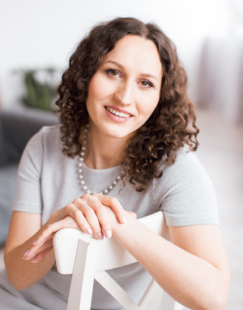

Hi! My name is Lisa Shashkova. Lisa a short version of a Russian name Elizaveta (Елизавета).

I'm a Software Developer at [JetBrains](https://www.jetbrains.com/), working on the [PyCharm IDE](https://www.jetbrains.com/pycharm/).
I've been working on Debugger for several years, and now I'm focused on Scientific Tools in PyCharm.

I graduated from [Physics and Mathematics Lyceum 239](http://www.239.ru/) in 2010 (yep, that's why sometimes I have 239 in 
my nicknames). I obtained Specialist's Degree (equivalent of Master’s degree) in Software Engineering at 
[St Petersburg State University](https://english.spbu.ru/) in 2015. Also I graduated from 
[Computer Science Center](https://compscicenter.ru/) in 2015.

Currently I'm living in a Russian city Saint Petersburg.

