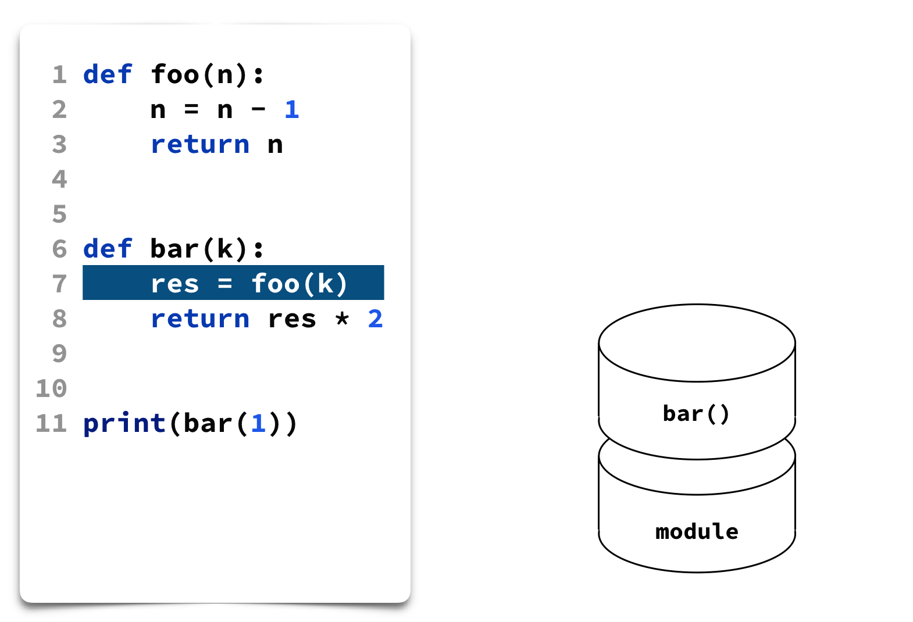
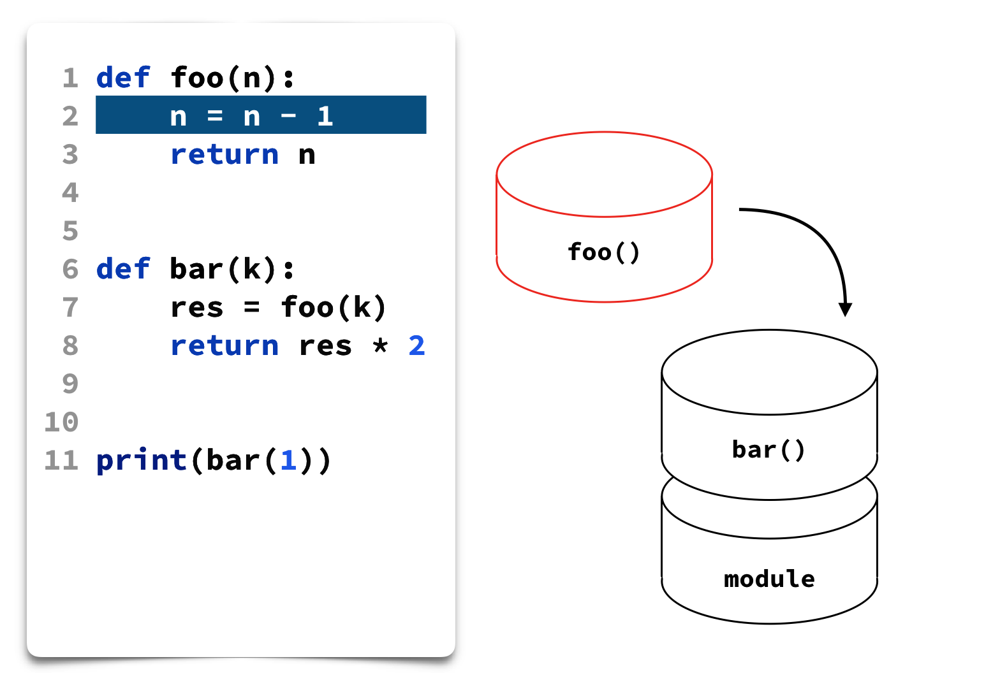

_This is the first part of the article, the second part is available [here]()._

Based on my PyCon US 2020 [Online Talk](https://youtu.be/yr6E7FwK_Hw)

Python language is very simple and beautiful, but very big part of the language power is hidden from user and available only at runtime, only during execution. You might even don't know about it, but you already use this hidden power every day!

In this article we will learn:

1. [Where we already use Runtime's Power](#power)
2. [How Python Runtime works](#python_runtime)
3. [How Python allows inspecting current program state](#inspect)

## Where we already use Runtime's Power <a name="power"></a>

For example, we run tests every day. Let's consider two popular ways to do it in Python: standard module [`unittest`](https://docs.python.org/3/library/unittest.html) or very popular test framework [`pytest`](https://docs.pytest.org/en/latest/contents.html). The easiest way to see the difference between them is to execute assert statements. 

In case of failure `unittest` will report assertion exception and will show you a place where it happened, just like any other exception in Python:

```
Traceback (most recent call last):
  File “/file.py”, line 8, in test_value
    assert a == 2, "Wrong value!"
AssertionError: Wrong value!
```

But `pytest` will show you detailed information about values which you tried to compare:

```
E       AssertionError: Wrong value!
E       assert 1 == 2
```

Where did `pytest` get this information? Of course, from the runtime!

## Python Runtime <a name="python_runtime"></a>

There is a popular phrase that "Everything is an object in Python". That means that every variable isn't just a piece of memory, but complicated entity with values and associated operations.

This object-based nature is true not only for core types like numbers, strings, collections or others. But it's also true for program unit objects like functions, classes or even modules.

* Core types
    * numbers, strings, collections
* Program unit objects
    * functions, classes, modules
    
All these types of objects are declared explicitly. Interpreter creates object when you use assignment statement, or when you declare new function with `def` keyword, or when you declare new class with `class` keyword.

But during the program execution Python interpreter creates not only objects which you defined explicitly in your code.  It also creates a lot of util objects representing execution process. And one of the key objects among them is a stack frame.

**Stack frame** object represents a program scope in Python. This object contains information about current execution state like code object, local and global variables and a lot of other data. 

Frames are stored in a stack-like structure. The bottommost frame sometimes called a "module frame", represents a module, from which execution was started. In this example execution process is on the line 7, and it's going to call function `foo()`:



When Python Interpreter enters new scope during execution, it creates new **frame** object and then puts it into the stack, on top of other frames:



When execution process leaves the scope (in our example, returns from function `foo()`), interpreter removes frame object from the top and passes some data to the previous frame, and execution in the previous frame continues and goes to the line 8. This is a very rough description, but the main idea looks like this. 

In fact this runtime machinery and the concept of call stack are the same for many other programming languages. But the major difference between them and Python is that not so many languages contain this runtime information **out of the box**. 

In Python, frame objects can be accessed as a usual Python objects right in your program, and you can retrieve a lot of interesting information from it!

## Getting Runtime Information <a name="inspect"></a>

As we discussed in the previous part, the key concept of the execution process is a **stack frame**. In any place of your program, you can get the current stack frame by calling function [`_getframe()`](https://docs.python.org/3/library/sys.html#sys._getframe) from standard module `sys`. This function returns a frame object from the call stack for the current thread. It has an optional argument depth, which determines a depth in a stack, that is the number of calls below the top. If you pass 0, you'll get the current frame.

As you can see its name starts with _, that means that it is not guaranteed to exist in all implementations of Python.

Frame object contains:
* `frame.f_locals` - local variables of the current scope
* `frame.f_globals` - global variables of the current scope
* `frame.f_code` - corresponding code object
* `frame.f_lineno` - current line number
* `frame.f_trace` - tracing function
* `frame.f_back` - previous frame
* Some other attributes

### Frame: Local and Global Variables

First of all frame object contains a dictionary with local variables of the current scope. If you defined some variable, you can access it by its name. It's just a usual dictionary, you can iterate over it, but you can't update it from Python code. It's possible to do only from C API.

Also, frame object gives you access to global variables' dictionary. When we're talking about global variables we mean global variables for the current module. 

To be honest, we don't need a frame object to get this information, because there are built-in functions [`locals()`](https://docs.python.org/3/library/functions.html#locals) and [`globals()`](https://docs.python.org/3/library/functions.html#globals), which return exactly the same dictionaries. But the good news is that variables dictionaries isn't the only interesting information stored in a frame object.

### Frame: Code Object

Code object represents a chunk of executable code, but it differs from function object, because it doesn't contain reference to the global execution environment. The easiest way to create code object is to call a built-in function [`compile()`](https://docs.python.org/3/library/functions.html#compile):

```
>>> c = compile('a + b', 'a.py', 'eval')
<code object <module> at 0x104f8fc90, file "a.py", line 1>
```

Compiled code object can be also evaluated by passing it to built-in function `eval()`:

```
>>> eval(c, {'a': 1, 'b': 2})
3
```

Code object contains a lot of information as well:

* `code.co_filename` - filename where it was created
* `code.co_name` - name of function or module
* `code.co_varnames` - names of variables
* `code.co_code` - compiled bytecode, 
disassemble with `dis.dis()`

### Frame: Other attributes

In addition to variables and code object, frame also stores information about current line number which is being executed. It stores a tracing function, which helps to trace events in the current frame, and which we discuss later. And it also stores a link to the previous frame.

As you remember, frames are stored in a stack-like data structure. And the easiest way to inspect state of current frames is to iterate over them with a link to the previous frame. This is exactly how exception traceback works! When exception was raised in your program, and if it wasn't handled, Python prints this beautiful tracebacks to output, so you can understand how you reached this place in the program. Frame objects and links between them is a mechanism, which helps to get this information and show it to you!

```
Traceback (most recent call last):
  File "file.py", line 12, in <module>
    print(bar(1))
  File "file.py", line 8, in bar
    res = foo(k)
  File "file.py", line 2, in foo
    raise ValueError("Wrong value!")
ValueError: Wrong value!
```

We've listed only the most important information stored in a frame object, but not **all** the information. Many useful functions are implemented in an `inspect` standard module. It has a whole [separate group of functions](https://docs.python.org/3/library/inspect.html#the-interpreter-stack) for examining the interpreter stack.

One important thing, which you should remember, when you work with frame variable is that you shouldn't forget to delete this variable when you're leaving the scope. 

```python
def handle_stackframe_without_leak():
    frame = inspect.currentframe()
    try:
        # do something with the frame
    finally:
        del frame
```

Otherwise, you will create a reference cycle, which can lead to delayed objects destruction and memory consumptions. It happens, because frame object has a dictionary of local variables, where we've already defined a local variable `frame`, which refers back to a frame object. That means, that reference counters will never become 0 for these objects and they will be destroyed only by garbage collector.

That's why you should delete `frame` local variable explicitly.
 
## Conclusion

In this part we've learnt that our source code implicitly generates many interesting objects and everybody can easily retrieve this information in any part of their Python program. In the second part we'll learn how different Development Tools use this runtime information and help us to become more productive in our everyday lives.
 
_This is the first part of the article, the second part is available [here]()._

 


 


