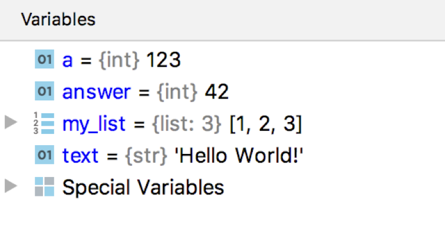

_This is the second part of the article, the first part is available [here]()._

Based on my PyCon US 2020 [Online Talk](https://youtu.be/yr6E7FwK_Hw)

In this part we'll learn how different development tools use Runtime information and help you to become more productive, when you're working with Python code:

1. [AssertionError in `pytest`](#assertion)
2. [Debugger](#debugger)
3. [Code coverage](#coverage)
4. [Runtime Typing Tools](#typing)
5. [Async Fault Handler](#handler)

## AssertionError in pytest <a name="assertion"></a>

As you remember, in the [first part]() we've learnt that `pytest` can show `AssertionError` with exact values which were compared. Now we have enough knowledge to understand how it was implemented. Let's create our own tool which will be showing values of variables which were used inside assertion statement. 

Every exception object stores a traceback object in a `__traceback__` attribute:

```python
tb = e.__traceback__  # traceback object
```

And it contains the most important for us object - `frame` object! We already know: if we have access to a frame object, we know everything about program state:

```python
tb.tb_frame  # frame object 
```

Our function will look like this: 
```python
def get_vars_names(source, line):
    # get variables names with `ast` module

def vars_in_assert(e):
    tb = e.__traceback__
    frame = tb.tb_frame
    code = frame.f_code
    line = tb.tb_lineno - code.co_firstlineno + 1
    source = inspect.getsource(code)
    for name in get_vars_names(source, line):
        if name in frame.f_locals:
            var = frame.f_locals[name]
            print(f"{name} = {var}")
```

It takes exception object as an argument. From exception object we can get traceback and frame. From a frame we can get code object, and from code object we can get everything! For example, a source code. We know line number, where exception happened, we have a source code.

So now with the help of standard module `ast`, we can get variables names used on this line. I don't show this function here, but you can find its source code in [my repository with examples](https://github.com/Elizaveta239/PyRuntimeTricks/blob/master/assertvars/assert_vars.py).

Now, when we have variables names, we can find variables values for these names, because we have a dictionary with local variables inside our frame object. And this is how it works!

We can use our function [the following way](https://github.com/Elizaveta239/PyRuntimeTricks/blob/master/assertvars/assert_vars_usage.py):
```
>>> try:
        assert a + b < 1
    except AssertionError as e:
        vars_in_assert(e)

File “/file.py", line 10, in foo
    assert a + b < 1
Variables Values:
a = 1
b = 2
``` 

During exception handling, pass exception object to it, and it'll print variables values to the output! It can be very helpful for example, for logging. If stack trace isn't enough, you can automatically log all the variables values used inside failed assertion statement. In fact, it can be extended to any exception, not only `AssertionError`.

## Debugger <a name="debugger"></a>

The second tool which heavily relies on Runtime is Debugger:


Nowadays debuggers are based on one of two main functions: 
* Tracing function
* Frame Evaluation function

When **Tracing function** was set for the frame, it will be called for every event which happens in the program. It takes the following arguments:

```python
tracefunc(frame, event, arg)
```

If Tracing function [was specified](https://docs.python.org/3/library/sys.html#sys.settrace), frame object stores a link to it in `f_trace` attribute. 

```python
sys.settrace(tracefunc)  # set to current frame
frame.f_trace  # stored in a frame
```

Debugger based on tracing function analyses events in the program and suspends it in a place, where breakpoint was set by user.

**Frame Evaluation function** (introduced in [PEP 523](https://www.python.org/dev/peps/pep-0523/)) has the following signature:

```python
frame_eval(frame, exc)
```

Frame evaluation function is being executed before the frame object is created. Debugger based on a frame evaluation function inserts breakpoint's code right into a frame's code object.

We're not going to discuss its internals now. If you want to learn more about it, feel free to watch my talk from PyCon US 2017 ["Debugging in Python 3.6: Better, Faster, Stronger"](https://youtu.be/NdObDUbLjdg).

What we are interested in now, is that both of these functions, take `frame` object as an argument. And all the things we've learnt in the previous part, help debugger to show information to user.

`frame.f_code.co_filename` and `frame.f_lineno` help debugger to understand whether execution reached a breakpoint and highlight corresponding line in the editor:
 

 
Variables Pane, where you see values of the local variables is based on `frame.f_locals` dictionary:
 


A list of frames, which you see during your debug session, is also received from `frame` object by iterating over `frame.f_back` attributes:


As you can see, information stored inside frames help debugger to work and show you information about current program state.

## Code coverage <a name="coverage"></a>

Another tool we're going to discuss today is a code coverage. 


Code coverage helps you to understand which lines in your codebase were executed during run and to check were they covered with tests or not. It's a very important tool, because it gives you a confidence that your codebase is well-developed and maintained.

The most popular library for code coverage in Python is [coverage.py](https://coverage.readthedocs.io/).


`coverage.py` is based on the same tracing function which we've already seen in the debugger. As you already know, tracing function takes 3 arguments, one of which is a frame object. Again, thanks to the frame object, coverage tool can collect information about a filename and a line number which was executed (with `frame.f_code.co_filename` and `frame.f_lineno`), store it and then show it inside your coverage report.

## Runtime Typing Tools <a name="typing"></a>

Another group of tools is Runtime Typing Tools. Tools which collect type information during program execution and then help you to generate type annotations inside your source code:

* [PyAnnotate](https://github.com/dropbox/pyannotate) by Dropbox
* [MonkeyType](https://github.com/Instagram/MonkeyType) by Instagram
* ["Collect Runtime types information"](https://www.jetbrains.com/help/pycharm/debugger-python.html) option in 
PyCharm

`PyAnnotate` by Dropbox collects types of function arguments and then inserts type annotations right into your code. `MonkeyType` by Instagram does something similar: it collects information about types of your arguments and then can generate stub files for your project based on collected information. 

The option "Collect Runtime types information" available in PyCharm does something similar as well. If this option is enabled, debugger starts to collect type information about every function which was called. Later, if you would like to generate docstring for some function, PyCharm will use collected information during the generation process. 

`PyAnnotate` and `MonkeyType` are both based on `sys.setprofile()`, which works with profile function, which is similar to tracing function:
 
 ```python
profilefunc(frame, event, arg)
```
 
It takes exactly the same arguments, but it isn't called on every line of your code, it's called only when you call some function or method. It's logical, because for tracing function arguments you need to trace only call events, not *every* event in your program.
 
As I've already said, "Collect Runtime types information" in PyCharm is integrated with debugger, so it also has access to a `frame` object.

So how can we get types of arguments in the current frame? First of all we can get a list of arguments names defined in the current frame, because everything is stored inside a `code` object:

```python
def arg_names(co):
    nargs = co.co_argcount
    names = co.co_varnames
    return list(names[:nargs])

names = arg_names(frame.f_code)
locs = frame.f_locals
objects = [locs[n] for n in names]
```

Also, we have a dictionary with local variables, so we have access to objects and therefore to their types. So, for each function we already know: variables names, their types, and location where this function was defined. We can store this information and use it later for type annotations generation.

This is how all these tools are implemented with the help of `frame` object and corresponding `code` object.

## Async Fault Handler <a name="handler"></a>

In this part we'll learn how Runtime information can help to detect problems with concurrent execution. 

### Concurrent execution

There are two ways to execute tasks concurrently inside one Python process: 
* Threads
* Asynchronous tasks

With the help of standard module `threading` you can start a new thread, which will execute your function concurrently:
```python
import threading

def fun():
    print("Hello!")

t = threading.Thread(target=fun)
t.start()
t.join()
```

For synchronisation between threads in Python there are synchronisation objects. The most fundamental synchronisation object is a lock object:
```python
lock = threading.Lock()
```

Thread can acquire lock object, and it means that the following block of code will be executed by this and only this thread until it will release this lock object. Lock objects are also context managers, so you can work with them with keyword `with`:
```python
lock.acquire()
# only one thread here
lock.release()

with lock:
    # equivalent 
```

### Deadlock
 
Running more than one thread and using lock objects sometimes can lead to a deadlock. Deadlock is a state, when several threads are waiting for resources, which can’t be released.


The easiest way to reproduce this situation is the following: create two threads, two lock objects and acquire these lock objects in different orders:

```python
def run1():
    with lock1:
        with lock2:
            # do sth

def run2():
    with lock2:
        with lock1:
            # do sth else

Thread(target=run1).start()
Thread(target=run2).start()
```

First thread acquires lock 1, second thread acquires lock 2. The first thread want to acquire lock 2, but it’s unavailable, so it starts to wait. Second thread want to acquire lock 1, but it’s also unavailable. As you can see, this situation can’t be resolved without program interruption. Because threads will be waiting for their lock objects forever.

### Deadlock detection

If you have a really large codebase, it might be difficult to detect deadlock in your code. And even static code analysis can’t help you here, because deadlock happens at runtime, during code execution.

We’ve already used `sys._getframe()` function, which returns frame object for the current thread. But there is also another useful function `sys.current_frames()`, which returns topmost stack frame for every thread in the current Python process.

With the help of this function we can create our own tool **Fault Handler** for deadlocks detection. This tool will:
* Print tracebacks for threads with some interval
* Help to find deadlock location

But there is one problem: this functionality is _already implemented_ in standard library. A function `dump_traceback()` from module `faulthandler` prints tracebacks of all the running threads to a file.

But not **all** the things were implemented before us! As you remember, there is a second way to execute some code concurrently: asynchronous tasks! And there are very similar synchronisation objects in `asyncio` module and therefore asynchronous deadlock can appear:

```python
alock = asyncio.Lock()

alock.acquire()
# only one task here
alock.release()

async with alock:
    # equivalent 
```

That means that there is a place, where we can apply our fresh knowledge about Python runtime and create asynchronous version of the **Fault Handler**!

### Async Fault Handler

Several useful functions are already implemented inside asyncio module. The first one is `asyncio.all_tasks()`, which returns all the running tasks in a loop. And the second one is task’s method `get_stack()`, which returns list of frames for this task.

Our async fault handler will work like this: in a separate thread we’re running in an infinite loop:
```python
def dump_traceback_later(timeout, loop):
    while True:
        sleep(timeout)
        dump_traceback(loop, timeout)
```
And with a given timeout we dump task’s tracebacks:
```python
def dump_traceback(loop):
    for task in asyncio.all_tasks(loop):
        task.print_stack()
```

You can find the whole source code [here](https://github.com/Elizaveta239/PyRuntimeTricks/blob/master/asyncfaulthandler/async_faulthandler.py).

Now, if we suspect we have an asynchronous deadlock somewhere in our code, we can quickly check it with our **Asynchronous Fault Handler** and find a place, where this deadlock appeared. Great! We’ve implemented simple, but powerful tool for detecting deadlocks with async tasks. And it was the last tool we were going to consider today.


## Conclusion

In this part we’ve learnt about several tools which are based on a program’s Runtime information. I would like to emphasise it one more time that these tools collect information which is impossible to get just from the source code. You can make some assumptions based on source code, but only at runtime you can get the real value of variables and the real program state. This is extremely cool feature of the Runtime-based Development Tools.

I hope, after reading this article you’ll start using Runtime Development Tools more often, because they really help to write more reliable code and find bugs in it much faster. And maybe you’ll even create your own new tool! After this article you have enough information to do it. Good luck!

_This is the second part of the article, the first part is available [here]()._


 
 
 


