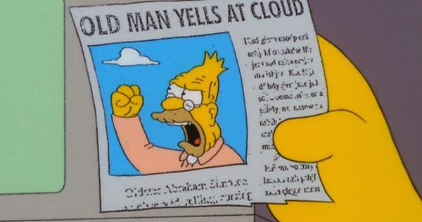
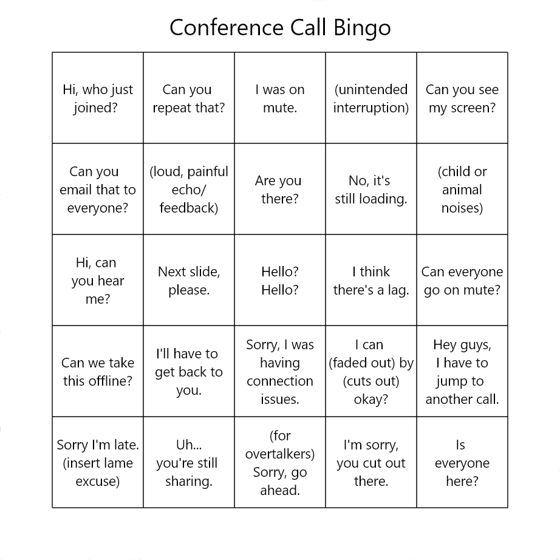
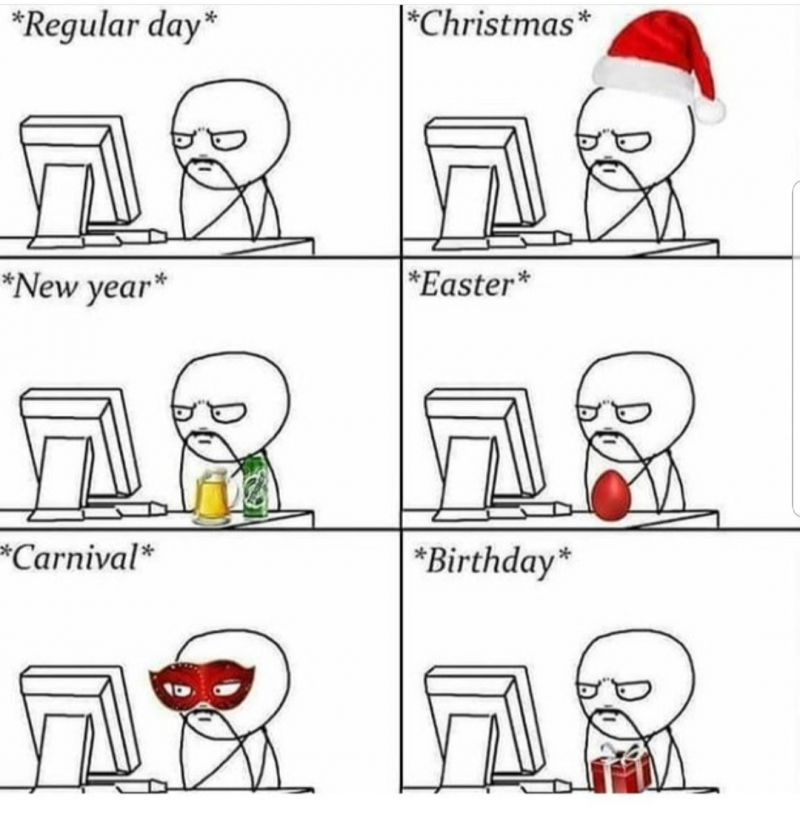
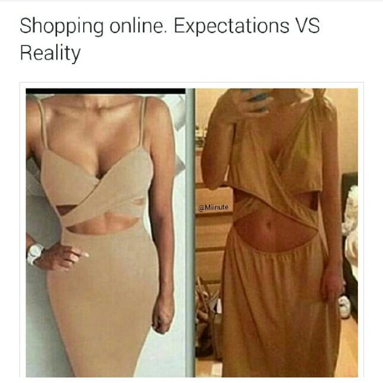

During the previous months, I’ve seen rather many posts and tweets from lucky people, who are very happy with our new remote "normality". Unfortunately, I’m not ready to share their joy. I hate Remote World. And I think, I’m not alone here.

_But there is the pandemic, and we should isolate from other people. We should be happy that modern technologies help us to stay connected! So why are you saying that?_

Firstly, because I can :)  
Secondly, because I want to make other opinions visible as well. Yes, I totally understand that we should decrease the number of face-to-face contacts and, of course, I’m doing it too. Yes, existing opportunities are better than nothing, but it doesn’t mean they don’t annoy me. And I want to express my annoyance here.

## Remote Work

I’ve never been a fan of remote work, and I never understood people who like it. Now I have no choice (at least until January 2021), and it drives me crazy sometimes. 

I miss having different locations for work and non-work activities. Home is place to feel relaxed and lazy, and office is a place to feel active and focused. There is a [nice video](https://www.youtube.com/watch?v=snAhsXyO3Ck) how to organize your workspace, but it doesn't help me. Maybe people who live in big houses with ten different rooms can organize comfortable areas for each activity, but I’m working, sleeping, eating and doing exercises in the same room since March. And I’m ready to throw tomatoes at anyone who says that remote work “increases quality of life”.

I miss informal communication with my amazing colleagues. All these minor things like having lunch together or discussing funny work-unrelated things were so great! Hundreds of great ideas were accidentally born at spontaneous conversations at coffee point! Of course, we set up “virtual coffee” meetings, but, to be honest, they’re so unnatural. Most often they turn into “How are you? - I’m fine - And you?” dialogs, which bring nothing but tiredness. 

I miss my commute. It was a guaranteed hour just with music and my thoughts, some kind of meditation. Half of it was walking, and it also was a guaranteed walk regardless of the weather. Now it's really hard to make myself to go outside, if the weather is bad or if there is no destination of my walk.

## Video Calls

In the very beginning there were a lot of [funny moments](https://youtu.be/DYu_bGbZiiQ) during video calls, but they don't look funny anymore now, after four months.

There is also one thing, which nobody mentions for unknown reasons: people on video calls don’t look into your eyes. Of course, they’re looking at your image on their screen, but you feel like they don’t want to look directly at you. Are they hiding something from you? Are they lying? No, it’s just a video call, so you should forget about most things which helped you to understand other people’s emotions and reactions. 

Also have you ever tried to give a talk or a presentation by video call? During my first online presentation I felt extremely overwhelmed: I’m sitting in an empty room, talking something into the camera. I know that there are people somewhere, but I can’t hear them, can’t see their faces, can’t see their reaction to my words, but they’re looking at me right now. And in the end there will be a long totally silent pause. Really weird feeling, do not recommend.

## Virtual Entertainment

_“Remote world is so cool! You can virtually attend thousands of online concerts, lectures, conferences! From any place of the world!”_

Yes, but don't forget that you'll be sitting at the same table at the same empty room and looking at the same monitor. And all these events will look like usual movies. A movie about concert, a movie about conference, a movie about… life?

For me movies and series has always been "time-killers": some nice addition at the end of the day, which adds something to your *real* day. It can't be the main event of the day. In several months I realised that I hardly remember, which events I "attended" a month ago. You know, there were some people on the screen…

It's also interesting how my brain has responded to all these virtual activities: I stopped dreaming about people who I know in real life (like friends, colleagues or relatives), but I started seeing different Instagram and YouTube bloggers right in my dreams. Just because they post a lot of content, my brain decided they're my new "friends" and "closest people". Really weird. 

## Virtual Shopping

It's a minor thing comparing to other items, but I still want to mention it. Virtual shopping can be useful for buying different things, but it's very bad for buying clothes. 

I don't know who are these lucky people with ideal bodies, who can precisely select suitable shapes and sizes just by a photo on the Internet. There are so many nuances! The color on the photo is different, a model on the photo has different body proportions, a cloth is uncomfortable for movements… It takes several days to wait for a cloth arrival, several days to return a non-suitable thing, several days to select another thing and so on and so forth. It's like a very-very slow visit to a real shop. And very-very annoying. 

I hope real shops won't disappear in the nearest future.

## So what?

I don't know. If nothing changes in a year or so, and it will become our (heaven forbid) "new normality", I think, I'll be ready to organize my own commune or sect of people who refuse to take part in virtual life. Not sure about the name yet, but we'll think of it during our first all-hands in-person meeting. Ready to join? :)

