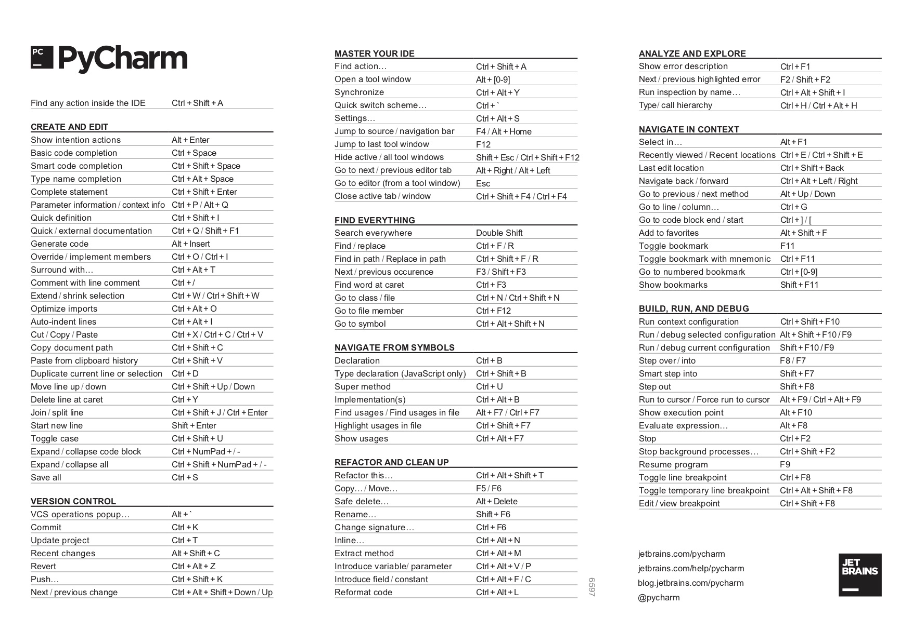

It’s time for a confession: I’m really bad at remembering shortcuts.

There were times, a long time ago, when I only started using JetBrains IDEs and among all shortcuts I used only **Ctrl+C** and **Ctrl+V** on an everyday basis 😅 From time to time I opened a [Keymap Reference](https://www.jetbrains.com/help/pycharm/keymap-reference.html) (Help -> Keymap Reference), stared at it for several minutes and didn’t believe I would ever learn all these items:

Do I know all of them now, six years later? Of course, no! 

But I remember shortcuts for actions, which I find useful and which make me productive and happy every day!

There are two quite simple ideas behind my **“shortcuts theory”**: 
1. Try to learn short shortcuts first (ideally two-keystroke shortcuts)
2. There is no need to remember default shortcuts, you can always configure them for yourself. [Re-assigning](https://www.jetbrains.com/help/pycharm/configuring-keyboard-and-mouse-shortcuts.html) a shortcut to your custom value will help you to remember it even better! Keymap is usually trying to be comfortable for an average user, but it doesn't guarantee it’ll be comfortable for you! 

When you learn about some new cool action, don’t try to remember its shortcut, but remember its name instead. After that you can always search for this action and [assign new](https://www.jetbrains.com/help/pycharm/configuring-keyboard-and-mouse-shortcuts.html) really short and easy to remember shortcut to it. And you’ll remember it much better! You can always use this [Paul Everitt’s video](https://youtu.be/NoDx0MEESDw?t=3566) for inspiration (my favorite moment is at 59:24 😊)

I do believe that the ideal shortcut should consist of 2 keystrokes. Here are my **Top-10** favorite shortcuts in PyCharm. Some of them consist of 2 keystrokes by default:
1. **Alt + Enter** - execute this shortcut if something is highlighted in your editor, and it will explain and suggest fixes.
2. **Double Shift** - execute it for search. Search everything and everywhere. Files, text, settings - everything is hidden behind this simple shortcut. The coolest thing is that it replaces 6 shortcuts altogether! You can just Press Double Shift and after that you can press Tab several times to select “Go to File” or “Go to Symbol” or other “Go to” actions! The best shortcut ever!
3. **Ctrl + E** (**⌘ E**) - show Recent Files. Very useful if you have too many tabs opened!
4. **Ctrl + Q** (**F1**) - show Documentation for the current element right inside an editor 
5. **Ctrl + P** (**⌘ P**) - show Parameters information. If you've already checked a documentation and started typing a function call, but forgot, for example, parameters order. This action will help you!
6. **Shift + Enter** - start a new line, even if a cursor inside some text.

    But some other shortcuts I re-assigned to 2-keystroke shortcuts in my environment:

7. **Extend / Shrink Selection** - I assigned it to Alt + Up / Down. By default, it’s **Ctrl + W/ Ctrl + Shift + W**, but I personally use it hundreds times a day, and I want to use arrows here.
8. **Navigate Back / Forward** - I assigned it to Ctrl + Up / Down. By default, it’s **Ctrl+Alt+Left / Right**, but again I use it many-many times every day when reading code and do believe it should be as short as possible.
9. **Introduce a Local Variable** - introduce a variable for some expression. Moreover, it can replace all the usages of this expression in the current scope! 
10. **Reformat a File** - it’s a 4-keystroke shortcut by default! **Ctrl+Alt+Shift+L**. Have you ever pressed 4-keystroke shortcuts? I never did it! At the same time the action is very cool and useful. Just re-assign it to Ctrl+L and feel happiness every time, when PyCharm magically transforms your code into pure beauty!

There are a lot of useful actions and settings in PyCharm, and it's impossible to learn them all! But if this post inspires you to learn at least one new action with a shortcut, that will be really great!
